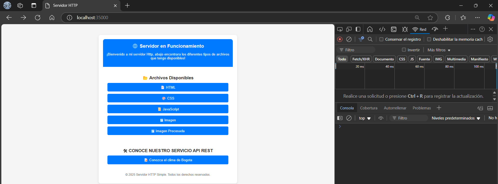
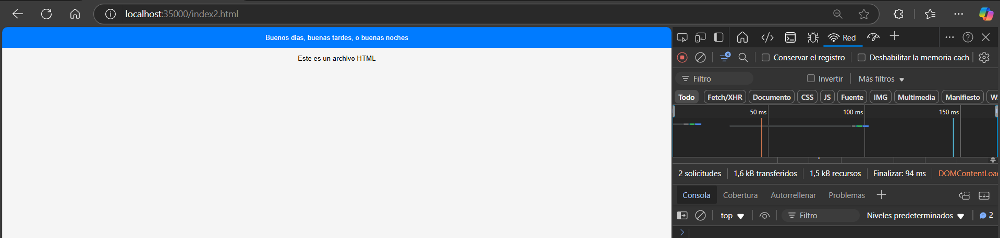
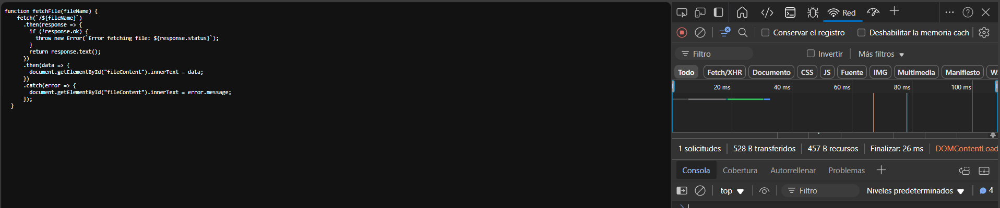
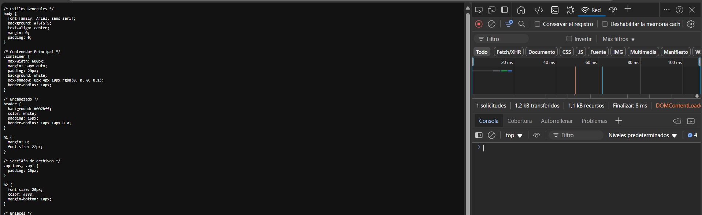
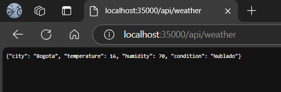

# Escuela Colombiana de Ingenieria
# Arquitecturas Empresariales

## Taller 1 Diseño y estructuración de aplicaciones distribuidas en internet

Se construyo un servidor web que lee archivos HTML, JavaScript, CSS e Imágenes (jpg) del disco local y retorna los archivos solicitados. 

Para probar el servidor, se realizo un formato de entrega de archivos, en el cual, el usuario, puede seleccionar que  tipo de archivo desea ver

Adicional se incluyo el servicio REST que nospermite saber el clima de una ciudad en especifico, en este caso, Bogota

---
### Prerequisitos

* [Maven](https://maven.apache.org/): Es una herramienta de comprensión y gestión de proyectos de software. Basado en el concepto de modelo de objetos de proyecto (POM), Maven puede gestionar la construcción, los informes y la documentación de un proyecto desde una pieza de información central.
* [Git](https://learn.microsoft.com/es-es/devops/develop/git/what-is-git): Es un sistema de control de versiones distribuido, lo que significa que un clon local del proyecto es un repositorio de control de versiones completo. Estos repositorios locales plenamente funcionales permiten trabajar sin conexión o de forma remota con facilidad.

### Instalación

1) Debemos clonar el repositorio
```
https://github.com/andres3455/Lab1Arep.git
```
2) Una vez clonamos, accedemos al directorio
```
cd Lab1Arep
```
3) Contruimos el proyecto
```
mvn package
```
---

## Ejecución

### Primera Forma
En la terminal de comando, utilizamos la sentencia:
```
mvn exec:java -"Dexec.mainClass"="edu.eci.arep.http.httpServer"  
```

### Segunda Forma
1) En la barra de navegación de nuestro IDE, buscamos la opción "Ejecutar".
   
2) Luego, elegimos la opción "iniciar depuración " o "Ejecutar sin depuración"


### CASOS DE USO

Una vez ejecutado, accedemos a la URL en un navegador

```
http://localhost:35000/
```



Aqui podemos observar formato de entrega de archivos, ahora probemos el comportamiento con cada uno de los archivos.

1) HTML


Este archivo incluye algo, basico, un archivo HTML con un saludo, y una especificación de su tipo

2) JS
.

Este archivo de tipo JS, una función llamada fetchFile(fileName), que realiza una solicitud HTTP para obtener el contenido de un archivo desde el servidor y lo muestra en la página.

3) CSS


El archivo CSS, contiene los estilos y propiedades, que utiliza el formato de inicio

4) Imagen (jpg)


Imagen del edificio I

5) API REST


